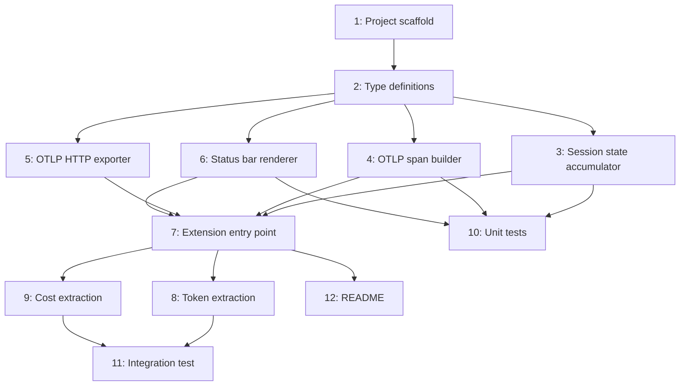

# Pi Statusline Collector — Architecture Plan

**Status:** Ready  
**Date:** 2026-08-09  
**Goal:** Build a Pi coding agent status bar collector under `collectors/pi/` that mirrors the existing Gemini/AGY status bar collector, emitting OTLP GenAI trace spans and rendering a branded terminal status bar.

---

## 1. Problem / Motivation

The dashboard already has an AGY collector (`collectors/gemini/statusline.py`) that:
- Renders an ANSI status bar showing model, tokens, and quota
- Exports OTLP spans to `localhost:4318/v1/traces` for session analysis

Pi sessions are already ingested by the dashboard via ObservMe (`@senad-d/observme`), but there is no **lightweight, dashboard-branded status bar collector** for Pi that mirrors the AGY experience. The goal is a Pi extension that:
1. Renders a `[PI]`-branded terminal status bar on turn completion
2. Emits OTLP/HTTP spans in the same JSON format as the AGY collector
3. Produces spans that the existing `PiAdapter` in `agentdash/adapters/pi.py` can detect and normalize

## 2. Approved decisions

| ID | Decision |
|----|----------|
| D1 | **Language**: TypeScript, matching Pi extension architecture (`@earendil-works/pi-coding-agent` types) |
| D2 | **Location**: `collectors/pi/` in the agent-session-analysis-dashboard repo |
| D3 | **OTLP endpoint**: `http://localhost:4318/v1/traces` with fallback to `http://127.0.0.1:4318/v1/traces`, JSON (not protobuf), matching AGY's approach |
| D4 | **Visual layout**: `[PI] 📁 repo │ 🌿 branch │ 🤖 model │ ⚡ tokens (breakdown) │ 💰 $cost │ ⏳ quota` |
| D5 | **Trigger events**: Hook `after_provider_response` for token/cost capture; hook `turn_end` for status bar render + OTLP export |
| D6 | **Span detection**: Emitted spans MUST include `observme.semconv.version` attribute OR both `pi.*` and `observme.*` namespace attributes so `PiAdapter.detect()` returns ≥ 0.9 confidence |
| D7 | **Token semantics**: `gen_ai.usage.input_tokens` is EXCLUSIVE of cache classes (matching Pi/ObservMe convention, NOT Copilot convention). `input + cache_read + cache_creation + output == total` |
| D8 | **Cost source**: Use Pi's self-reported `pi.llm.cost.*_usd` attributes — do NOT apply rates.json pricing |
| D9 | **Service name**: `service.name` = `"pi"` in resource attributes |
| D10 | **No OTel SDK dependency**: Use raw HTTP POST with `fetch()` (Node 18+ built-in), matching AGY's zero-dependency approach. Avoids `@opentelemetry/sdk-trace-node` weight. |
| D11 | **Extension discovery**: Ship as an installable npm package with `pi.extensions` manifest in `package.json`, installable via `pi install npm:<package>` or copyable to `~/.pi/agent/extensions/` |

## 3. Investigation findings

### AGY Collector Architecture (`collectors/gemini/statusline.py`, 738 lines)
- **Input**: Reads JSON from stdin (piped by AGY on each turn)
- **OTLP payload**: Hand-built JSON matching OTLP/HTTP JSON format, POSTed with `urllib.request`
- **Resource attributes**: `service.name`, `service.instance.id`, `vcs.repository.name`
- **Scope**: `opentelemetry.instrumentation.gen_ai`
- **Span kind**: 3 (CLIENT)
- **Token attributes**: Standard OTel GenAI keys (`gen_ai.usage.input_tokens`, `.output_tokens`, `.cache_read.input_tokens`, `.cache_creation.input_tokens`)
- **Custom AGY breakdown**: `gen_ai.usage.sys_tokens`, `.tool_tokens`, `.skill_tokens`, `.rule_tokens`, `.msg_tokens`
- **Session**: `gen_ai.session.id`, `copilot_chat.chat_session_id`
- **Dual endpoint**: Tries `127.0.0.1:4318` first, falls back to `localhost:4318`
- **Timeout**: 800ms per endpoint
- **Async**: Fires OTLP export in a background thread, joins with 800ms timeout before exit

### PiAdapter Detection Requirements (`agentdash/adapters/pi.py`, lines 170-191)
The adapter uses a confidence scoring system:
- **1.0**: `observme.semconv.version` attribute present (strongest)
- **1.0**: Both `pi.*` AND `observme.*` namespace attributes present
- **0.9**: `pi.*` attributes AND span name starts with `pi.`
- **0.0**: None of the above

### PiAdapter Normalization Requirements (lines 204-275)
- **Span names expected**: `pi.agent.run`, `pi.llm.request`, `pi.tool.call` (for ops); `pi.session`, `pi.turn`, etc. (structural)
- **Token fields**: `gen_ai.usage.input_tokens` (exclusive), `gen_ai.usage.cache_read.input_tokens`, `gen_ai.usage.cache_creation.input_tokens`, `gen_ai.usage.output_tokens`, `gen_ai.usage.reasoning.output_tokens`
- **Model**: `gen_ai.response.model` → `gen_ai.request.model` → `pi.model.id.current`
- **Session**: `pi.session.id` (present on every span, used for grouping)
- **Agent**: `pi.agent.display_name` → `gen_ai.agent.name`
- **Cost**: `pi.llm.cost.total_usd` mapped to `reported_cost_usd`
- **Validation**: Adapter checks `pi.llm.usage.total_tokens == input + cache_read + cache_creation + output`

### Pi Extension API
- Entry point: `export default function(pi: ExtensionAPI): void`
- Event registration: `pi.on(eventName, async (event, ctx) => { ... })`
- Status bar: `ctx.ui?.setStatus?.(key, value)` or `ctx.ui.notify()`
- Events available: `session_start`, `turn_start`, `before_provider_request`, `after_provider_response`, `turn_end`, `agent_end`, `session_shutdown`
- Package manifest: `package.json` with `pi.extensions` field

### Key difference from AGY
AGY's collector is a **standalone Python script** invoked by AGY via stdin pipe. Pi's collector will be a **TypeScript extension** running inside the Pi process, receiving events via callbacks. This means:
- No stdin parsing needed — data arrives via event objects
- Export must be non-blocking (don't slow Pi's turn loop)
- Status bar output goes through Pi's `ctx.ui` API, not raw `process.stdout`
- Extension has access to accumulating session state across turns

## 4. Task list

| # | Phase | Component | Description | Skills |
|---|-------|-----------|-------------|--------|
| 1 | Setup | Project scaffold | Create `collectors/pi/` with `package.json` (name, version, pi.extensions manifest, TypeScript config), `tsconfig.json`, `.gitignore` for node_modules | TypeScript, npm |
| 2 | Setup | Type definitions | Create `src/types.ts` with interfaces for Pi extension events (`AfterProviderResponseEvent`, `TurnEndEvent`, `SessionStartEvent`), token/cost data shapes, and OTLP payload types | TypeScript |
| 3 | Core | Session state accumulator | Create `src/session-state.ts` — a class that accumulates per-session state across turns: session_id, model, repo, branch, running token totals, cost totals, turn count. Reset on `session_start`. Updated on `after_provider_response` and `turn_end` | TypeScript |
| 4 | Core | OTLP span builder | Create `src/otlp.ts` — function `buildOtlpPayload(state: SessionState): OtlpPayload` that constructs the OTLP/HTTP JSON payload matching AGY's structure. Must include: (a) Resource: `service.name=pi`, `service.instance.id`, `vcs.repository.name`; (b) Scope: `opentelemetry.instrumentation.gen_ai`; (c) Span: kind=3, name=`chat {model}`, all GenAI token attrs, Pi-specific attrs (`pi.session.id`, `pi.llm.cost.total_usd`); (d) Detection attrs: `observme.semconv.version` for PiAdapter compatibility | TypeScript |
| 5 | Core | OTLP HTTP exporter | Create `src/exporter.ts` — async function `exportSpan(payload: OtlpPayload): Promise<void>` using Node `fetch()` to POST JSON to `localhost:4318/v1/traces` with fallback to `127.0.0.1:4318/v1/traces`. Non-blocking with 800ms timeout. Swallow all errors silently (collector must never crash Pi) | TypeScript |
| 6 | Core | Status bar renderer | Create `src/statusbar.ts` — function `renderStatusBar(state: SessionState): string` that produces ANSI-colored output: `[PI] 📁 repo │ 🌿 branch │ 🤖 model │ ⚡ 22k │ 💰 $0.05 │ ⏳ 78%`. Use Pi's `ctx.ui?.setStatus?.()` API for rendering if available, fall back to `console.error()` for terminal output | TypeScript |
| 7 | Integration | Extension entry point | Create `src/extension.ts` — default export function that: (a) hooks `session_start` → initialize SessionState; (b) hooks `after_provider_response` → extract tokens/cost/model from event, update SessionState; (c) hooks `turn_end` → render status bar, fire async OTLP export; (d) hooks `session_shutdown` → final export if pending | TypeScript |
| 8 | Integration | Token extraction | In `src/extension.ts` `after_provider_response` handler: extract `gen_ai.usage.input_tokens` (exclusive), `cache_read.input_tokens`, `cache_creation.input_tokens`, `output_tokens`, `reasoning.output_tokens` from event data. Extract model from `gen_ai.response.model` or `pi.model.id.current`. Map to SessionState fields respecting exclusive semantics (D7) | TypeScript |
| 9 | Integration | Cost extraction | In `src/extension.ts` `after_provider_response` handler: extract `pi.llm.cost.total_usd`, `pi.llm.cost.input_usd`, `pi.llm.cost.output_usd`, `pi.llm.cost.cache_read_usd`, `pi.llm.cost.cache_write_usd` from event data. Accumulate per-session running total | TypeScript |
| 10 | Testing | Unit tests | Create `src/__tests__/otlp.test.ts` — test `buildOtlpPayload` produces correct JSON structure; verify PiAdapter-compatible attributes are present; verify token semantics (exclusive input). Create `src/__tests__/statusbar.test.ts` — test `renderStatusBar` output formatting. Create `src/__tests__/session-state.test.ts` — test accumulation across turns | TypeScript, Jest/Vitest |
| 11 | Testing | Integration test | Create `src/__tests__/integration.test.ts` — mock Pi `ExtensionAPI`, simulate `session_start` → `after_provider_response` → `turn_end` sequence, verify OTLP payload is exported and status bar is rendered. Verify emitted span passes `PiAdapter.detect()` confidence ≥ 0.9 | TypeScript, Jest/Vitest |
| 12 | Docs | README | Create `collectors/pi/README.md` with installation instructions (`pi install` or manual copy), configuration (OTLP endpoint override), and architecture overview | Markdown |

## 5. Sequencing / dependency graph



**Critical path**: 1 → 2 → 3,4,5,6 (parallel) → 7 → 8,9 (parallel) → 11

## 6. Residual decisions / risks

| # | Item | Status | Resolution |
|---|------|--------|------------|
| R1 | **Pi event object shape**: The exact TypeScript type of `event` in `after_provider_response` and `turn_end` handlers is not documented publicly — must be discovered from `@earendil-works/pi-coding-agent` types or ObservMe source | Open | Implementer to inspect Pi's published type definitions or ObservMe's `src/extension.ts` for the event shapes |
| R2 | **Status bar API availability**: `ctx.ui?.setStatus?.(key, value)` may not be available in all Pi versions. Need fallback to `console.error` | Low risk | Use optional chaining; fall back gracefully |
| R3 | **Node fetch availability**: Pi runs on Node 18+, so global `fetch()` should be available. If not, fall back to `http` module | Low risk | Feature-detect `globalThis.fetch` |
| R4 | **Span name compatibility**: Emitting `pi.llm.request` as span name ensures `PiAdapter.is_relevant()` accepts it. If we use `chat {model}` (like AGY), the span would be rejected by `is_relevant()` since the name is not in SPAN_OPS or STRUCTURAL_SPANS | **Critical** | Must use `pi.llm.request` as span name, NOT `chat {model}`. This differs from AGY. |
| R5 | **Duplicate spans**: If ObservMe is also installed, both extensions would emit spans for the same events. The dashboard would see duplicates. | Medium risk | Document in README that this collector is an alternative to ObservMe, not complementary. Or add dedup logic keyed on `pi.session.id` + turn index |
| R6 | **npm package name**: Need to decide on the npm package name for publishing | Open | Suggest `@dpalfery/pi-statusline` or similar scoped name |

## 7. Out of scope

| Item | Why | Where it belongs |
|------|-----|-----------------|
| Replacing ObservMe | This collector coexists with or is an alternative to ObservMe — not a replacement | Future enhancement if desired |
| Tool call span emission | AGY collector doesn't emit tool spans; this mirrors AGY's scope | Could be added as a follow-up |
| 5-section turn context breakdown | Pi doesn't expose sys/tools/skills/rules/msg breakdown like AGY does — it would require prompt parsing that Pi's privacy model doesn't support | N/A — Pi architectural limitation |
| protobuf OTLP export | JSON is simpler and matches AGY. Protobuf would require `@opentelemetry/otlp-proto-exporter` | Future optimization |
| Dashboard PiAdapter changes | The existing adapter should already detect the emitted spans. No adapter changes planned | Validate during integration testing |
| Publishing to npm | Initial version is local-only; npm publishing is a follow-up | Future task |

## 8. Required skills

| Skill | Used in tasks |
|-------|--------------|
| TypeScript | 1-11 |
| npm / package.json | 1, 12 |
| Pi Extension API (`@earendil-works/pi-coding-agent`) | 2, 7, 8, 9, 11 |
| OTLP/HTTP JSON protocol | 4, 5, 10, 11 |
| OpenTelemetry GenAI semantic conventions | 4, 8, 10 |
| ANSI terminal formatting | 6, 10 |
| Jest or Vitest testing | 10, 11 |
| Markdown documentation | 12 |

## 9. Verification harness

### Unit test coverage (Task 10)
- `otlp.test.ts`: Verify `buildOtlpPayload` output structure matches OTLP/HTTP JSON schema. Assert `service.name === "pi"`. Assert `observme.semconv.version` attribute is present. Assert span kind === 3. Assert `gen_ai.usage.input_tokens` is exclusive of cache classes.
- `statusbar.test.ts`: Verify output contains `[PI]` badge. Verify token formatting (e.g. `22.0k`). Verify cost formatting (e.g. `$0.0523`). Verify ANSI color codes are correct.
- `session-state.test.ts`: Verify multi-turn accumulation. Verify reset on new session. Verify cost accumulation across turns.

### Integration test (Task 11)
- Mock `ExtensionAPI` and simulate full lifecycle: `session_start` → 3× (`after_provider_response` → `turn_end`) → `session_shutdown`
- Capture exported OTLP payloads and verify:
  - Each turn produced exactly one span export
  - Span attributes pass `PiAdapter.detect()` with confidence ≥ 0.9
  - Token totals match: `input + cache_read + cache_creation + output === pi.llm.usage.total_tokens`
  - Cost attributes are present when cost data is available
  - Session ID is consistent across all spans

### Manual validation
- Install extension in a live Pi session
- Verify status bar renders in terminal after each turn
- Verify spans appear in the dashboard (Aspire or local OTLP collector)
- Verify `PiAdapter` picks up the spans and normalizes them correctly
- Verify no duplicate spans when ObservMe is NOT installed

### Critical compatibility check (R4)
- The span name MUST be `pi.llm.request` to pass `PiAdapter.is_relevant()` — verify in integration test that `is_relevant()` returns `true` for the emitted span name

## Appendix A: File structure

```
collectors/pi/
├── package.json              # npm manifest with pi.extensions
├── tsconfig.json             # TypeScript config
├── .gitignore                # node_modules, dist/
├── README.md                 # Installation & usage docs
└── src/
    ├── extension.ts          # Entry point: default export function
    ├── types.ts              # Pi event interfaces, OTLP types
    ├── session-state.ts      # Per-session state accumulator
    ├── otlp.ts               # OTLP span payload builder
    ├── exporter.ts           # HTTP POST to localhost:4318
    ├── statusbar.ts          # ANSI status bar renderer
    └── __tests__/
        ├── otlp.test.ts
        ├── statusbar.test.ts
        ├── session-state.test.ts
        └── integration.test.ts
```

## Appendix B: OTLP payload reference (target output)

```json
{
  "resourceSpans": [{
    "resource": {
      "attributes": [
        {"key": "service.name", "value": {"stringValue": "pi"}},
        {"key": "service.instance.id", "value": {"stringValue": "my-project"}},
        {"key": "vcs.repository.name", "value": {"stringValue": "my-project"}}
      ]
    },
    "scopeSpans": [{
      "scope": {"name": "opentelemetry.instrumentation.gen_ai"},
      "spans": [{
        "traceId": "...",
        "spanId": "...",
        "name": "pi.llm.request",
        "kind": 3,
        "startTimeUnixNano": "...",
        "endTimeUnixNano": "...",
        "attributes": [
          {"key": "gen_ai.operation.name", "value": {"stringValue": "chat"}},
          {"key": "gen_ai.system", "value": {"stringValue": "pi"}},
          {"key": "gen_ai.request.model", "value": {"stringValue": "claude-sonnet-4-20250514"}},
          {"key": "gen_ai.response.model", "value": {"stringValue": "claude-sonnet-4-20250514"}},
          {"key": "gen_ai.agent.name", "value": {"stringValue": "pi"}},
          {"key": "gen_ai.session.id", "value": {"stringValue": "sess-abc123"}},
          {"key": "pi.session.id", "value": {"stringValue": "sess-abc123"}},
          {"key": "observme.semconv.version", "value": {"stringValue": "1.0.0"}},
          {"key": "gen_ai.usage.input_tokens", "value": {"intValue": 5000}},
          {"key": "gen_ai.usage.output_tokens", "value": {"intValue": 1200}},
          {"key": "gen_ai.usage.cache_read.input_tokens", "value": {"intValue": 3000}},
          {"key": "gen_ai.usage.cache_creation.input_tokens", "value": {"intValue": 500}},
          {"key": "pi.llm.usage.total_tokens", "value": {"intValue": 9700}},
          {"key": "pi.llm.cost.total_usd", "value": {"doubleValue": 0.0523}},
          {"key": "pi.llm.cost.input_usd", "value": {"doubleValue": 0.015}},
          {"key": "pi.llm.cost.output_usd", "value": {"doubleValue": 0.036}},
          {"key": "pi.llm.cost.cache_read_usd", "value": {"doubleValue": 0.001}},
          {"key": "pi.llm.cost.cache_write_usd", "value": {"doubleValue": 0.0003}}
        ],
        "status": {"code": 1}
      }]
    }]
  }]
}
```
